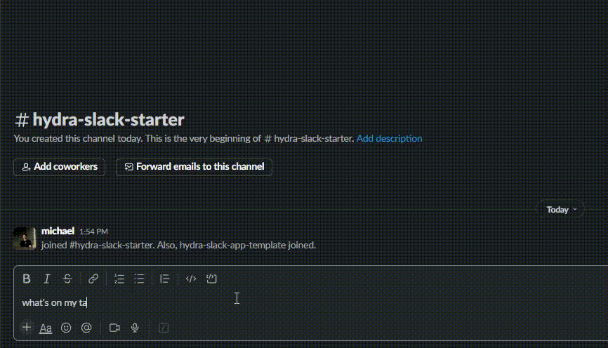

<h1 align="center">Hydra AI Slack App Starter Template</h1>

This app uses Hydra AI to process user messages and dynamically show UI components in Slack based on what the user is trying to do.

  <a href="#concept"><strong>Concept</strong></a> ·
  <a href="#quickstart"><strong>Quickstart</strong></a> ·
  <a href="#project-structure"><strong>Project Structure</strong></a>

 

  

## Quickstart:

0. Follow instructions here to install the app in your Slack workspace: [slack app setup instructions](https://github.com/slack-samples/bolt-ts-starter-template?tab=readme-ov-file#create-a-slack-app)
1. Setup your `.env` file:

   The app requires the following environment variables for Hydra:

   - `HYDRA_API_KEY`: Your Hydra AI API key, which you can generate [here](https://usehydra.ai/dashboard)
   - `SLACK_BOT_TOKEN`: Should be setup during step 0 above.
   - `SLACK_APP_TOKEN`: Should be setup during step 0 above.

1. `npm install`
2. `npm start`
3. Add the app to a channel and try sending a message like 

## Concept

Hydra is designed to simplify how to build AI into apps. Instead of trying to think through all the complexities of AI systems, the app design flow when using Hydra is:

1. Define what actions a user should be able to perform. Often this just means defining what data structures your app will store, and what actions you want the user to be able to perform on that data.
2. Define the UI components that are needed to perform those actions, where each component has props, or parameters, that allow different options for usage.
3. Register those components with Hydra.
4. Let Hydra choose and show the appropriate components dynamically based on the user's input messages.

 Here's how it works in this template:

**Define Actions**

The user should be able to create, read, update, and delete from a list of `Task` objects, where each `Task` has an `id`, `name`, and `status`. The status should be `not started` or `complete`.

Example user messages that should trigger these actions:

- "Create a task to buy milk"
- "Show my tasks that are not complete"

**Component Definitions**

To enable the above actions, we need to define UI components that let the user create, read, update, and delete `Task` objects.

We can use a TaskForm component for creating and editing `Task` objects. We can use a TaskList component for reading, and deleting `Task` objects.

**Register Components**

We tell Hydra about the TaskForm and TaskList components, including:

- The component name and description of when it should be used.
- The component parameters/props and their descriptions.
- Any functions that Hydra might need to call to fetch extra context that should be used when generating the components.

**Let Hydra do the rest**

We set up a message listener that sends all messages to Hydra, and lets Hydra add generated components to the message response.

## Project Structure:

- Hydra is configured in `src/hydra-config.ts`. This is where we tell Hydra about the components we want to use, and where we get an instance of the Hydra client object to use elsewhere in the app when processing messages.

- The `TaskForm` component is defined in `src/components/task-form.tsx` using the `jsx-slack` library. 

- The `TaskForm`'s "Save" button triggers a "saveTaskForm" action under `src/listeners/actions/task-form/save-task-form.ts`, which calls an "api method" that updates the user's config in the "database".

- The "database" and "api methods" are defined in `src/api/task-service.ts` as a local representation of what your api might look like.

- The message listener that sends all messages to Hydra is defined in `src/listeners/messages/hydra-message.ts`. This handles all the interaction with Hydra and logic for updating the message response with generated components and intermediate progress.

